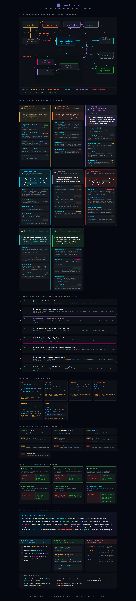

# ⚛️ React + Vite Architecture — For Dummies

You ran one command, a dozen files appeared out of nowhere, and now you're staring at them wondering what any of it actually does. This README walks through every single file and folder — what it is, why it exists, and how they all talk to each other. No assumed knowledge. No skipping the obvious stuff.

[](https://logicencoder.github.io/react-vite-architecture-for-dummies)

👆 **Click the image to open the full interactive architecture map**

---

## First things first — what even are React and Vite?

Before anything else, let's get this straight, because most tutorials just assume you know.

### React

React is a **JavaScript library** made by Facebook/Meta. A library — not a framework. The difference matters: a framework tells you how to structure your whole app and makes decisions for you. A library is more like a tool you pick up and use for one specific job. React's job is **building user interfaces**.

The way it works is simple in concept: instead of manually updating the webpage every time something changes, you describe what the page *should look like* based on your data, and React figures out what actually needs to update. Click a button, a number goes up — React finds that one number on the page and changes just that. Nothing else reloads. Nothing else flickers. That's the whole idea.

It lets you build your UI out of small reusable pieces called **components**. A button is a component. A header is a component. A whole page can be a component. You build them separately and snap them together like Lego.

### Vite

Vite (pronounced *"veet"*, it's French for "fast") is a **build tool**. It's not part of your app — your users never download it. It's a developer tool that sits between you and the browser.

Here's the problem it solves: browsers don't understand TypeScript or JSX (the HTML-looking syntax React uses). They only understand plain JavaScript. So someone needs to take your `.tsx` files, compile them into regular `.js`, bundle everything together, and serve it to the browser. That's Vite's job. It also runs a local development server at `localhost:5173` and instantly updates the browser every time you save a file — no manual refresh needed.

Think of it like a kitchen: React is the recipe, Vite is the oven. You write React components, Vite bakes them into something the browser can eat.

> **So to summarise:** React builds the UI. Vite compiles and serves it. You need both.

---

## The three things in your project

Once you understand that, the whole file structure makes sense. Everything in a React + Vite project is one of three things:

- **Config files** — they set the rules for how tools behave. You barely touch them.
- **Folders** — where your code and libraries actually live on disk.
- **The injection chain** — three specific files that wire everything together and make your app actually appear in the browser.

Let's go through each one.

---

## Config files

### `package.json`

This is your project's identity card and shopping list combined. It tells npm (the package manager) two things: which libraries your project needs, and what commands you can run.

When you type `npm run dev`, npm opens this file, finds the `"dev"` script, sees it says `"vite"`, and runs Vite. That's the entire chain. Without this file, nothing works — npm doesn't know what your project is or what to do with it.

```json
"scripts": {
  "dev":   "vite",         ← npm run dev  → starts localhost:5173
  "build": "vite build"    ← npm run build → creates final files for deployment
},
"dependencies": {
  "react":     "^18.2.0",  ← libraries your app needs in the browser
  "react-dom": "^18.2.0"
},
"devDependencies": {
  "vite":      "^5.0.0"    ← tools only needed during development, not shipped to users
}
```

Every time you install a new library with `npm install something`, this file updates automatically.

---

### `pnpm-lock.yaml` (or `package-lock.json`)

`package.json` says *"I need React version 18 or newer."* But that's vague — 18.2.0 and 18.3.1 are both valid. The lock file records the **exact** version that was actually installed, down to the patch number. Not just React, but also every library that React itself depends on internally.

Why does this matter? Because without it, your colleague running `npm install` on their machine might get slightly different versions than you, which can cause subtle bugs that are a nightmare to debug. The lock file guarantees everyone gets identical code.

You never open this file. You never edit it. You just always commit it to Git alongside your code.

---

### `tsconfig.json` / `tsconfig.app.json` / `tsconfig.node.json`

These configure TypeScript — the language you're actually writing in. TypeScript is JavaScript with an extra layer on top that checks your code for mistakes before it runs. These files tell it how strict to be.

There are three of them because two different environments are involved. Your React components run in the browser. Your Vite config file runs in Node.js on your computer. Browser and Node have different capabilities, so TypeScript needs different rules for each. The root `tsconfig.json` just points to the other two.

The most important setting in there is `"strict": true` — with that on, TypeScript catches a whole class of bugs that would otherwise only show up at runtime in the browser.

Leave these files alone until you know what you're doing. The defaults work fine.

---

### `vite.config.ts`

This is the control panel for Vite. The single most important line in the whole file is this:

```ts
plugins: [react()]
```

That one line is what makes Vite understand React. Without it, Vite has no idea what JSX is. You'd write `<div>Hello</div>` and Vite would throw a syntax error because it looks like broken JavaScript to a tool that doesn't know about React. The `react()` plugin teaches Vite to recognise and compile JSX correctly.

You also configure things like which port the dev server runs on, and where the final built files go. But most of the time you don't need to touch this file at all — the defaults work for most projects.

---

### `.gitignore`

A plain text file with a list of files and folders that Git should completely ignore — meaning they never get uploaded to GitHub.

The most critical entry is `node_modules/`. That folder can be 300MB of auto-generated code. There's zero reason to upload it because anyone who clones your repo can recreate it in seconds with `npm install`. It would be like emailing someone a copy of Microsoft Word just so they could read your `.docx` file.

```
node_modules/    ← 300MB of packages, regenerated by npm install
dist/            ← built output, regenerated by npm run build
.env             ← environment variables — can contain secret API keys
```

The `.env` entry is a security thing. If you ever put API keys or database passwords in a `.env` file, this stops them from accidentally ending up on GitHub where anyone can read them.

---

## Folders

### `node_modules/`

This is where the actual code of every library you installed physically lives. When you write `import { useState } from 'react'` in your code, Vite resolves that import by going into `node_modules/react/` and finding the real files.

It's created entirely by `npm install` and can easily be 300MB because modern packages have deep dependency chains — React depends on a scheduler, the scheduler depends on something else, and so on, often hundreds of packages deep.

The rules are simple: never open it, never edit anything inside it, never commit it to Git. And if something seems broken, deleting the whole folder and running `npm install` again fixes it surprisingly often.

---

### `public/`

Files you put here go straight to the browser untouched — Vite doesn't compile or process them at all. They just get copied to the final build as-is.

You reference these files with a leading slash directly in your code, no import statement needed:

```jsx

<link rel="icon" href="/favicon.ico" />
```

Use this folder for things like your favicon, a logo that needs to be at a predictable URL, or a `robots.txt` file. Anything where you need the file to keep its exact original filename.

---

### `src/`

This is where you actually work. Everything here gets compiled by Vite before the browser sees it. TypeScript becomes JavaScript. JSX becomes regular function calls. Multiple files get bundled together.

```
src/
├── main.tsx        ← the bridge (explained below)
├── App.tsx         ← your root component, the start of your UI
├── App.css         ← styles for App.tsx
├── index.css       ← global styles applied to the whole page
└── components/     ← you create this folder yourself
    ├── Header.tsx
    └── Button.tsx
```

Every component you build, every hook you write, every stylesheet you create — it all goes in here. This is your world.

---

## The injection chain

This is the part most tutorials gloss over, and it's the part that actually matters most. Here's the thing: when a browser opens your app, it doesn't just magically get a React application. It receives a plain HTML file. React has to *inject itself* into that HTML. Here's exactly how that happens.

### Step 1 — `index.html`

The browser's starting point. This file is almost completely empty — that's intentional. Its entire purpose is two lines: an empty div with the id `root`, and a script tag that loads `main.tsx`.

```html
<body>
  <div id="root"></div>
  <!--  ↑ completely empty right now. React will fill it. -->

  <script type="module" src="/src/main.tsx"></script>
  <!--  ↑ this loads the next step -->
</body>
```

Right now, at this moment, the page is a blank white screen. The div exists but has nothing in it. React hasn't run yet. This is completely normal.

---

### Step 2 — `main.tsx`

This file has exactly one job: find that empty div and mount your React application inside it.

```tsx
import { StrictMode } from 'react'
import { createRoot } from 'react-dom/client'
import App from './App.tsx'
import './index.css'

createRoot(document.getElementById('root')!).render(
  <StrictMode>
    <App />
  </StrictMode>
)
```

`createRoot` finds the div by its id and hands control of it to React. From this moment, React owns everything inside that div. The `!` after `getElementById` is TypeScript syntax — it tells TypeScript "this element definitely exists, don't warn me about it being null."

`StrictMode` is a wrapper that only does anything in development — it runs some extra checks to help you find bugs early. It has zero effect on the production build.

---

### Step 3 — `App.tsx`

This is what actually gets rendered into the div. It's your root component — the trunk of the tree. Every other component you build will either live directly inside App.tsx, or inside something that App.tsx uses.

```tsx
import { useState } from 'react'

function App() {
  const [count, setCount] = useState(0)
  // useState creates a piece of memory that React tracks.
  // When it changes, React re-renders this component.

  return (
    <div>
      <h1>Hello World</h1>
      <button onClick={() => setCount(count + 1)}>
        Count: {count}
      </button>
    </div>
  )
}

export default App
```

When the user clicks the button, `setCount` updates the count, React sees the change, re-renders just this component, and updates the button text. The rest of the page stays untouched. No reload. No flicker. Just the minimum necessary update.

Open DevTools → Elements after your app loads and you'll see this:

```html
<div id="root">
  <div>                      ← React put all of this here
    <h1>Hello World</h1>
    <button>Count: 0</button>
  </div>
</div>
```

That div was empty before `main.tsx` ran. React filled it.

---

## Quick reference

| File / Folder | One-line explanation | Touch it? |
|--------------|---------------------|-----------|
| `package.json` | Library list + CLI commands | ✅ Yes — when adding libraries |
| `pnpm-lock.yaml` | Exact installed versions | ❌ Never — auto-managed |
| `tsconfig.json` | TypeScript strictness rules | 🔸 Rarely |
| `vite.config.ts` | Build engine settings | 🔸 Sometimes — when adding plugins |
| `.gitignore` | What Git ignores | 🔸 Sometimes — when adding secrets |
| `node_modules/` | Actual library source code | ❌ Never — auto-generated |
| `public/` | Static files, no processing | ✅ Yes — favicons, images |
| `src/` | Your app code | ✅ Always — this is your workspace |
| `index.html` | Blank HTML shell with one div | 🔸 Rarely |
| `main.tsx` | Wires React into the HTML | 🔸 Rarely — set once and forget |
| `App.tsx` | Your root component | ✅ Yes — starting point for your UI |

---

## The 5 things worth remembering

**1. React is a library, Vite is a build tool.** React builds your UI. Vite compiles and serves it. They're two separate things that work together.

**2. `vite.config.ts` needs `plugins: [react()]`.** That one line is what makes Vite understand JSX. Remove it and everything breaks immediately.

**3. `index.html` starts empty.** A blank white page when first loading is completely normal — React hasn't mounted yet. It fills the page a split second later.

**4. `main.tsx` is the bridge.** It's the file that connects the blank HTML page to your React app. One file, one job.

**5. `node_modules/` is not your code.** Delete it any time you want. `npm install` gets it all back in seconds. Never commit it to Git, never edit anything inside it.

---

## The full chain in one line

```
package.json → npm install → node_modules → vite.config.ts → src/ → index.html → main.tsx → App.tsx → 🌐 Browser
```

---

## Files in this repo

| File | What it is |
|------|-----------|
| `index.html` | Interactive architecture map — open in browser |
| `README.md` | This file |
| `React-Vite-—-Architecture-03-20-2026_19_39.png` | Preview screenshot |

🌐 **Live version:** [logicencoder.github.io/react-vite-architecture-for-dummies](https://logicencoder.github.io/react-vite-architecture-for-dummies)

---

*Made by [logicencoder](https://github.com/logicencoder) · React 18 + Vite 5 + TypeScript*
